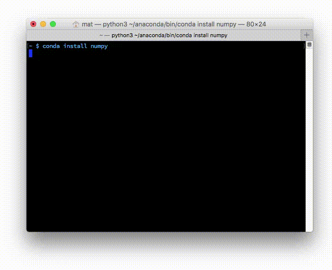
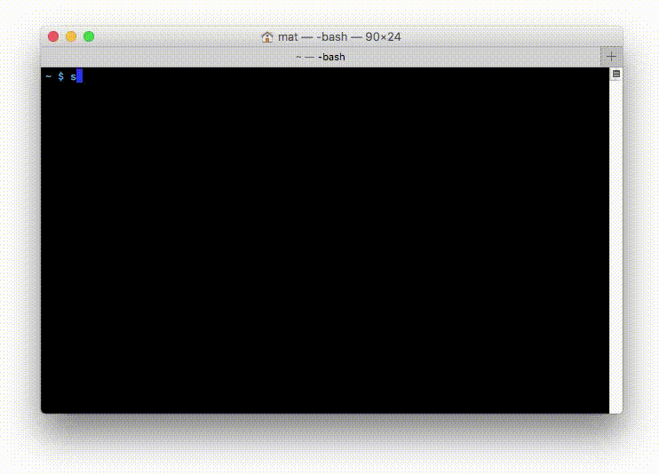

            

  <h3>
安装说明
</h3>
  

  <h1 id="安装-anaconda">安装 Anaconda</h1>

Anaconda 可用于 Windows、Mac OS X 和 Linux。可以在 <a href="https://www.anaconda.com/download/" rel="noopener noreferrer" target="_blank">https://www.anaconda.com/download/</a> 上找到安装程序和安装说明。

如果计算机上已经安装了 Python，这不会有任何影响。实际上，脚本和程序使用的默认 Python 是 Anaconda 附带的 Python。

选择 Python 3.12 版本（你也可以根据具体的需要选择 Python 2 的版本）。此外，如果是 64 位操作系统，则选择 64 位安装程序，否则选择 32 位安装程序。选择下载合适的版本，并继续进行安装！

完成安装后，会自动进入默认的 conda 环境，而且所有包均已安装完毕，如下面所示。可以在终端或命令提示符中键入 <code>conda list</code>，以查看你安装的内容。

<figure class="figure">
  
 <figcaption class="figure-caption">

在 Windows 上，会随 Anaconda 一起安装一批应用程序：

<ul>
<li>Anaconda Navigator，它是用于管理环境和包的 GUI</li>
<li>Anaconda Prompt 终端，它可让你使用命令行界面来管理环境和包</li>
<li>Spyder，它是面向科学开发的 IDE</li>
</ul>

为了避免报错，推荐在默认环境下更新所有的包。打开 Anaconda Prompt （或者 Mac 下的终端），键入：

<pre><code>conda upgrade --all</code></pre>

并在提示是否更新的时候输入 y（Yes）以便让更新继续。初次安装下的软件包版本一般都比较老旧，因此提前更新可以避免未来不必要的问题。

在本课的余下部分，强烈建议以这种方式开始使用 Anaconda，之后再根据需要使用 GUI。

          

 
 

            

  <h3>
序言
</h3>
  

  <h1 id="anaconda">Anaconda</h1>

如何使用 <a href="https://www.continuum.io/why-anaconda" rel="noopener noreferrer" target="_blank">Anaconda</a> 来管理 Python 所用的包和环境。Anaconda 能让你在数据科学的工作中轻松安装经常使用的程序包。你还将使用它创建虚拟环境，以便更轻松地处理多个项目。Anaconda 简化了工作流程，并且解决了多个包和 Python 版本之间遇到的大量问题。

Anaconda 实际上是一个软件发行版，它附带了 <code>conda</code>、Python 和 150 多个科学包及其依赖项。应用程序 <code>conda</code> 是包和环境管理器。Anaconda 的下载文件比较大（约 500 MB），因为它附带了 Python 中最常用的数据科学包。如果只需要某些包，或者需要节省带宽或存储空间，也可以使用 <a href="https://conda.io/miniconda.html" rel="noopener noreferrer" target="_blank">Miniconda</a> 这个较小的发行版（仅包含 <code>conda</code> 和 Python）。但你仍可以使用 <code>conda</code> 来安装任何可用的包，只是它自身没有附带这些包而已。

<code>conda</code> 只能通过命令行来使用。因此，如果你觉得它很难用，可以参考<a href="https://learn.microsoft.com/zh-cn/windows/terminal/command-line-arguments?tabs=windows" target="_blank">面向 Windows 的命令提示符教程</a>，或者学习面向 OSX/Linux 用户的命令行基础知识课程。

你可能已经安装了 Python，并且想知道为何还需要 Anaconda。首先， Anaconda 附带了一大批常用数据科学包，因此你可以立即开始处理数据。其次，使用 <code>conda</code> 来管理包和环境能减少将来在处理数据过程中使用到的各种库与版本时遇到的问题。

<h2 id="管理包">管理包</h2>

  <h3></h3>
  

  <figure class="figure">
    
    <figcaption class="figure-caption">
      
使用 conda 安装 numpy

    </figcaption>
  </figure>

  <h3></h3>
  

  
包管理器用于在计算机上安装库和其他软件。你可能已经熟悉 <code>pip</code>，它是 Python 库的默认包管理器。<code>conda</code> 与 <code>pip</code> 相似，不同之处是可用的包以数据科学包为主，而 <code>pip</code> 适合一般用途。与此同时，<code>conda</code> 并非像 <code>pip</code> 那样专门适用于 Python，它也可以安装非 Python 的包。它是支持任何软件的包管理器。也就是说，虽然并非所有的 Python 库都能通过 Anaconda 发行版和 conda 获得，但同时它也支持非 Python 库的获得。在使用 conda 的同时，你仍可以使用 <code>pip</code> 来安装包。

Conda 安装了预编译的包。例如，Anaconda 发行版附带了使用 <a href="https://docs.continuum.io/mkl-optimizations/" rel="noopener noreferrer" target="_blank">MKL 库</a>编译的 Numpy、Scipy 和 Scikit-learn，从而加快了各种数学运算的速度。这些包由发行版的贡献者维护，这意味着它们通常滞后于最新版本。但是，由于有人需要利用这些包来进行系统构建，因此它们往往更为稳定，而且也更便于你使用。

<h2 id="环境">环境</h2>

  <h3></h3>
  

  <figure class="figure">
    
    <figcaption class="figure-caption">
      
使用 conda 创建环境

    </figcaption>
  </figure>

  <h3></h3>
  

  
除了管理包之外，conda 还是虚拟环境管理器。它类似于另外两个很流行的环境管理器，即 <a href="https://virtualenv.pypa.io/en/stable/" rel="noopener noreferrer" target="_blank">virtualenv</a> 和 <a href="https://github.com/yyuu/pyenv" rel="noopener noreferrer" target="_blank">pyenv</a>。

你可以使用conda环境管理器分隔不同项目的包。你常常要使用依赖于某个库的不同版本的代码。例如，你的代码可能使用了 Numpy 中的新功能，或者使用了已删除的旧功能。实际上，不可能同时安装两个 Numpy 版本。你要做的应该是，为每个 Numpy 版本创建一个环境，然后在项目的对应环境中工作。

在应对 Python 2 和 Python 3 时，此问题也会常常发生。你可能会使用在 Python 3 中不能运行的旧代码，以及在 Python 2 中不能运行的新代码。同时安装两个版本可能会造成许多混乱和错误，而创建独立的环境会好很多。

你也可以将环境中的包列表导出为文件，然后将该文件与代码打包在一起。这能让其他人轻松加载代码的所有依赖项。pip 提供了类似的功能，即 <code>pip freeze &gt; requirements.txt</code>。

          

            

  <h3></h3>
  

  <h1 id="管理包">管理包</h1>

安装了 Anaconda 之后，管理包是相当简单的。要安装包，请在终端中键入 <code>conda install package_name</code>。例如，要安装 numpy，请键入 <code>conda install numpy</code>。

  <figure class="figure">
      
          <figcaption class="figure-caption">

你还可以同时安装多个包。类似 <code>conda install numpy scipy pandas</code> 的命令会同时安装所有这些包。还可以通过添加版本号（例如 <code>conda install numpy=1.10</code>）来指定所需的包版本。

Conda 还会自动为你安装依赖项。例如，<code>scipy</code> 依赖于 <code>numpy</code>，因为它使用并需要 <code>numpy</code>。如果你只安装 <code>scipy</code> (<code>conda install scipy</code>)，则 conda 还会安装 <code>numpy</code>（如果尚未安装的话）。

大多数命令都是很直观的。要卸载包，请使用 <code>conda remove package_name</code>。要更新包，请使用 <code>conda update package_name</code>。如果想更新环境中的所有包（这样做常常很有用），请使用 <code>conda update --all</code>。最后，要列出已安装的包，请使用前面提过的 <code>conda list</code>。

如果不知道要找的包的确切名称，可以尝试使用 <code>conda search search_term</code> 进行搜索。例如，我知道我想安装 <a href="https://www.crummy.com/software/BeautifulSoup/" rel="noopener noreferrer" target="_blank">Beautiful Soup</a>，但我不清楚确切的包名称。因此，我尝试执行 <code>conda search beautifulsoup</code>。

  <h3></h3>
  

  <figure class="figure">
    
    <figcaption class="figure-caption">
      
搜索 beautifulsoup

    </figcaption>
  </figure>

  <h3></h3>
  

  
它返回可用的 Beautiful Soup 包的列表，并列出了相应的包名称 <code>beautifulsoup4</code>。

  <h3></h3>
  

  <form>
    <fieldset>
      <legend>
通过 conda ，你可使用以下哪个命令来安装包 <code>numpy</code> 和 <code>pandas</code>？（多选）
</legend>
    </fieldset>
    

      <input type="checkbox" value="a1480541673069" name="220072" id="a1480541673069">
      <label for="a1480541673069">
<code>conda install numpy</code>
</label>
    

    

      <input type="checkbox" value="a1480541700965" name="220072" id="a1480541700965">
      <label for="a1480541700965">
<code>conda install pandas</code>
</label>
    

    

      <input type="checkbox" value="a1480541709026" name="220072" id="a1480541709026">
      <label for="a1480541709026">
<code>conda install numpy pandas</code>
</label>
    

  </form>

  

    
<strong>SOLUTION:</strong>

    <ul>
      <li>`conda install pandas`</li>
      <li>`conda install numpy pandas`</li>
  </ul>
  

<main class="container">
        

          

            

  <h3></h3>
  

  <h1 id="最佳做法">最佳做法</h1>
<h2 id="使用环境">使用环境</h2>

对开发者有很大帮助的一点是，Python 2 和 Python 3 具有独立的环境。可以使用 <code>conda create -n py2 python=2</code> 和 <code>conda create -n py3 python=3</code> 创建两个独立的环境，即 <code>py2</code> 和 <code>py3</code>。现在，每个 Python 版本都有一个通用环境。在所有这些环境中，都安装了大多数常用的标准数据科学包（numpy、scipy、pandas 等）。

建议为每个项目创建环境，这样对于与数据不相关的项目（例如使用 Flask 开发的 Web 应用）很有用。

<h2 id="共享环境">共享环境</h2>

在 GitHub 上共享代码时，最好同样创建环境文件并将其包括在代码库中。这能让其他人更轻松地安装你的代码的所有依赖项。对于不使用 conda 的用户，通常还会使用 <code>pip freeze</code>（<a href="https://pip.pypa.io/en/stable/reference/pip_freeze/" rel="noopener noreferrer" target="_blank">在此处了解详情</a>）将一个 pip <code>requirements.txt</code> 文件导出并包括在其中。

<h2 id="了解更多信息">了解更多信息</h2>

要详细了解 conda 以及它如何融入到 Python 生态系统中，请查看这篇由 Jake Vanderplas 撰写的文章：<a href="https://jakevdp.github.io/blog/2016/08/25/conda-myths-and-misconceptions/" rel="noopener noreferrer" target="_blank">Conda myths and misconceptions</a>（有关 conda 的迷思和误解）。此外，如果你有多余精力，也可以参考这篇 <a href="http://conda.pydata.org/docs/using/index.html" rel="noopener noreferrer" target="_blank">conda 文档</a>。

</main>
      
<main class="container">
  

  <h2 id="保存和加载环境">保存和加载环境</h2>

共享环境这项功能确实很有用，它能让其他人安装你的代码中使用的所有包，并确保这些包的版本正确。你可以使用 <code>conda env export &gt; environment.yaml</code> 将包保存为 <a href="http://www.yaml.org/" rel="noopener noreferrer" target="_blank">YAML</a>。命令的第一部分 <code>conda env export</code> 用于输出环境中的所有包的名称（包括 Python 版本）。

  <h3></h3>
  

  <figure class="figure">
    
    <figcaption class="figure-caption">
      
将导出的环境输出到终端中

    </figcaption>
  </figure>

  <h3></h3>
  

  
上图中，你可以看到环境的名称和所有依赖项及其版本。导出命令的第二部分 <code>&gt; environment.yaml</code> 将导出的文本写入到 YAML 文件 <code>environment.yaml</code> 中。现在可以共享此文件，而且其他人能够用于创建和你项目相同的环境。

要通过环境文件创建环境，请使用 <code>conda env create -f environment.yaml</code>。这会创建一个新环境，而且它具有同样的在 <code>environment.yaml</code> 中列出的库。

<h2 id="列出环境">列出环境</h2>

如果忘记了环境的名称（我有时会这样），可以使用 <code>conda env list</code> 列出你创建的所有环境。你会看到环境的列表，而且你当前所在环境的旁边会有一个星号。默认的环境（即当你不在选定环境中时使用的环境）名为 <code>root</code>。

<h2 id="删除环境">删除环境</h2>

如果你不再使用某些环境，可以使用 <code>conda env remove -n env_name</code> 删除指定的环境（在这里名为 <code>env_name</code>）。

</main>
      
<main class="container">
        

          

            

  <h3></h3>
  

  <h1 id="管理环境">管理环境</h1>

如前所述，你可以使用 conda 创建环境以隔离项目。要创建环境，请在终端中使用 <code>conda create -n env_name list of packages</code>。在这里，<code>-n env_name</code> 设置环境的名称（<code>-n</code> 是指名称），而 <code>list of packages</code> 是要安装在环境中的包的列表。例如，要创建名为 <code>my_env</code> 的环境并在其中安装 numpy，请键入 <code>conda create -n my_env numpy</code>。

  <h3></h3>
  

  <figure class="figure">
    
    <figcaption class="figure-caption">
    </figcaption>
  </figure>

  <h3></h3>
  

  
创建环境时，可以指定要安装在环境中的 Python 版本。这在你同时使用 Python 2.x 和 Python 3.x 中的代码时很有用。要创建具有特定 Python 版本的环境，请键入类似于 <code>conda create -n py3 python=3</code> 或 <code>conda create -n py2 python=2</code> 的命令。实际上，我在我的个人计算机上创建了这两个环境。我将它们用作与任何特定项目均无关的通用环境，以处理普通的工作（可轻松使用每个 Python 版本）。这些命令将分别安装 Python 3 和 Python 2 的最新版本。要安装特定版本（例如 Python 3.3），请使用 <code>conda create -n py python=3.3</code>。

<h2 id="进入环境">进入环境</h2>

创建了环境后，在 OSX/Linux 上使用 <code>source activate my_env</code> 进入环境。在 Windows 上，请使用 <code>activate my_env</code>。

<figure class="figure">
    
        <figcaption class="figure-caption">
         </figcaption>
</figure>

进入环境后，你会在终端提示符中看到环境名称，它类似于 <code>(my_env) ~ $</code>。环境中只安装了几个默认的包，以及你在创建它时安装的包。你可以使用 <code>conda list</code> 检查这一点。在环境中安装包的命令与前面一样：<code>conda install package_name</code>。不过，这次你安装的特定包仅在你进入环境后才可用。要离开环境，请键入 <code>source deactivate</code>（在 OSX/Linux 上）。在 Windows 上，请使用 <code>deactivate</code>。

  <h3>
“创建环境”测试题
</h3>
  

  <form>
    <fieldset>
      <legend>
你将使用哪个命令来创建名为 <code>data</code> 且安装了 Python 3.5、numpy 和 pandas 的环境？
</legend>
    </fieldset>
      

        <input type="radio" value="a1477602911049" name="220085" id="a1477602911049">
        <label for="a1477602911049">
conda env create -n data python=3.5 numpy pandas
</label>
      

      

        <input type="radio" value="a1477603599067" name="220085" id="a1477603599067">
        <label for="a1477603599067">
conda create data python=3.5 numpy pandas
</label>
      

      

        <input type="radio" value="a1477603600155" name="220085" id="a1477603600155">
        <label for="a1477603600155">
conda create -n data python=3.5
</label>
      

      

        <input type="radio" value="a1477603618435" name="220085" id="a1477603618435">
        <label for="a1477603618435">
conda create -n data python=3.5 numpy pandas
</label>
      

  </form>

  

    
<strong>SOLUTION:</strong>

    conda create -n data python=3.5 numpy pandas
  

</main>
  
<main class="container">
        

          

            

  <h3></h3>
  

  <h1 id="本门课程使用的-python-版本">本门课程使用的 Python 版本</h1>

人工智能导论实验部分将专门使用（或者已经使用） Python 3。 

<h2 id="为何选择-python-3">为何选择 Python 3</h2>
<ul>
<li>Python 2.7 逐渐<a href="https://pythonclock.org/" rel="noopener noreferrer" target="_blank">过时了</a></li>
<li>Python 3.10及以上具有很多出色的功能，例如<a href="https://docs.python.org/zh-cn/3.11/whatsnew/index.html" rel="noopener noreferrer" target="_blank">Python的新变化</a></li>
</ul>

目前，Python 3 中已经具有很多新的功能，没必要再使用 Python 2，除非你使用的是旧版代码。所有新的 Python 代码应该用 Python 3 编写。

<h2 id="python-2-和-python-3-之间的主要差别">Python 2 和 Python 3 之间的主要差别</h2>

大部分情况下，Python 2 代码也可以用 Python 3 运行。当然，Python 3 中推出的大部分新功能无法向后兼容。而 Python 2 代码经常运行失败的是 <code>print</code> 语句。

对于大部分的旧版 Python，包括 Python 2，输出功能如下所示：

<pre><code>print "Hello", "world!"
&gt; Hello world!</code></pre>

Python 3 中改成了一个函数。

<pre><code>print("Hello", "world!")
&gt; Hello world!</code></pre>

在 2.6 版中，<code>print</code> 函数通过 <code>__future__</code> 模块向后移植到 Python 2：

<pre><code># 在 Python 2.6 及以上版本中
from __future__ import print_function
print("Hello", "world!")
&gt; Hello world!</code></pre>

<code>print</code> 语句在 Python 3 中无法运行。如果你要输出内容，并希望在两个版本的 Python 中都可以，则需要在 Python 2 代码中导入 <code>print_function</code>。

</main>  
